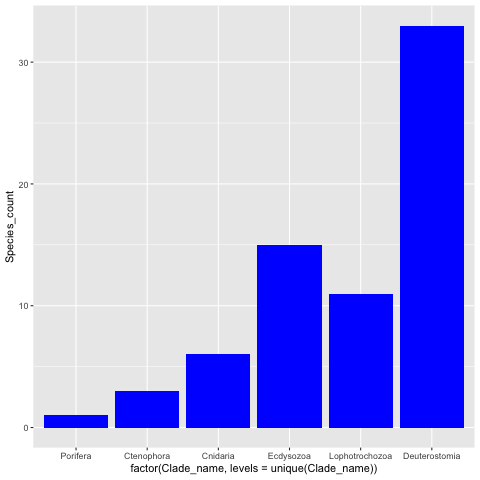
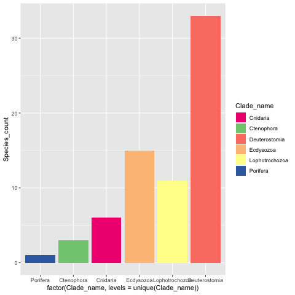
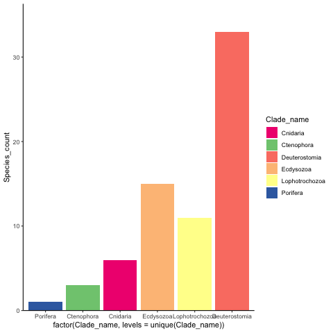
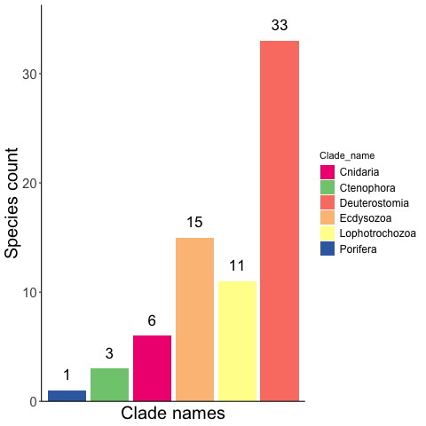
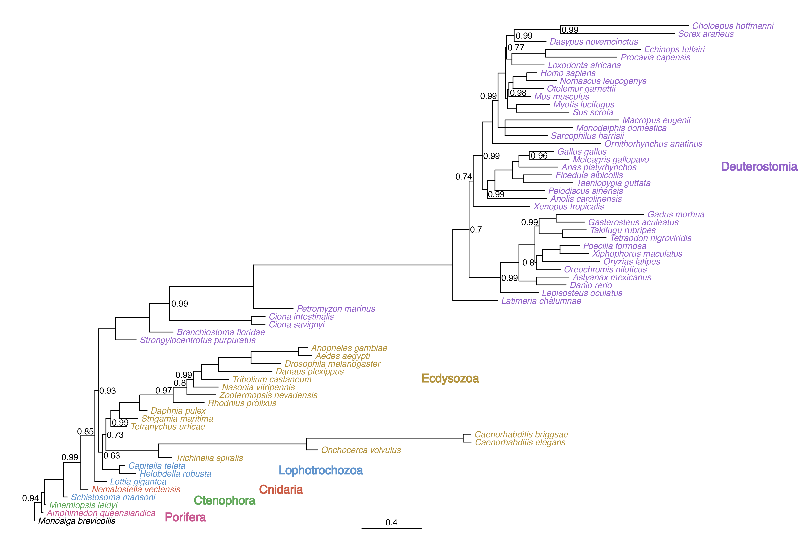
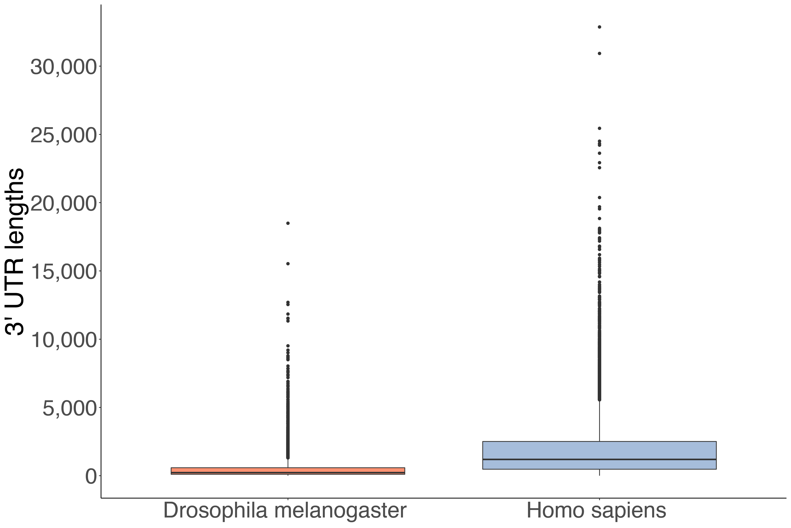
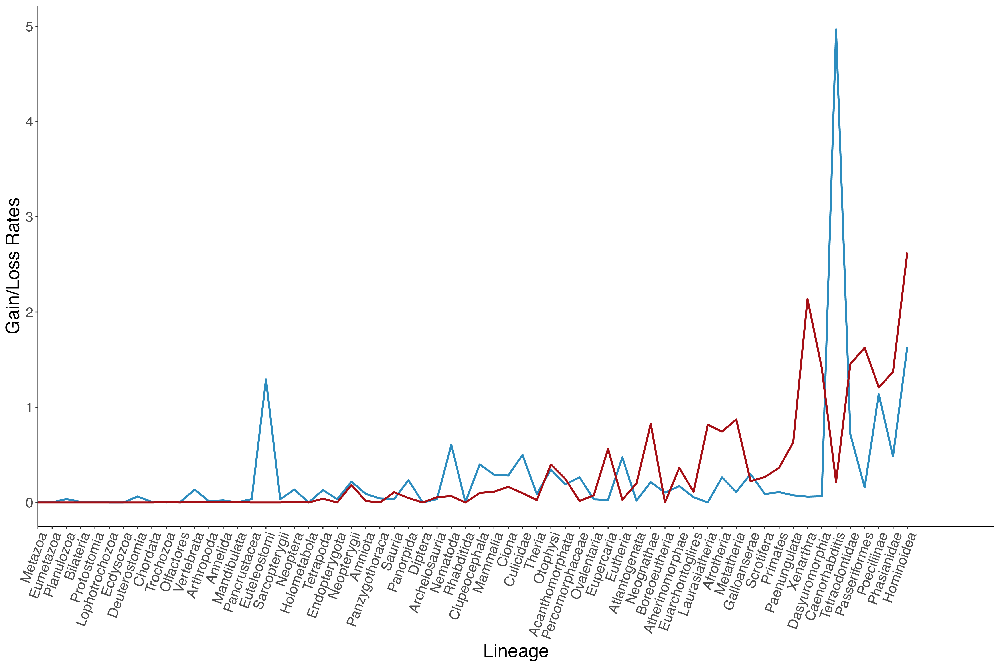

# Collection of scripts to make simple plots in r using ggplot

## Input data

An excel spreadsheet (preferebly in csv format) is the standard input file for plotting using ggplot.

Eg. A table named `animal_species_count.csv` with animal phyla and the number of species in each.

| Clade_name       | Species_count |
| ---------------- | ------------- |
| Porifera         | 	1	   |
| Ctenophora       |	3	   |
| Cnidaria         |	6	   |
| Lophotrochozoa   |	11	   |
| Ecdysozoa        |	15	   |
| Deuterostomia    |	33	   |

You can load the data file in manually into R or import it from ([R commmand line](https://www.statmethods.net/inputimportingdata.html))

```Shell
df <- read.table("Filename.csv", header = TRUE)
```

## Using ggplot to create plots of the data

In order to create plots using ggplot you first need to make sure the package is installed in r by typing 

```Shell
install.packages("ggplot2")
```

Then load the package by typing 
```Shell
library(ggplot2)
```

There are two main components of any ggplot plot.

* First is `ggplot(animal_species_count, aes(x = Clade_name, y = Species_count))`, with clade names on the x axis and species counts on the y axis

* Second is the type of plot you wish to make (in this case a barchart `geom_bar(stat = "identity", fill = "blue")`

**Note** `geom_bar` can be changed to any type of plot eg. scatter plot: `geom_point`, box plot: `geom_boxplot` or violin plot: `geom_violin` etc.

Together these two main components can be written as:

```Shell
ggplot(taxa_spread, aes(x = Clade_name, y = Species_count)) + 
geom_bar(stat = "identity", fill = "blue")
```

To retain the order of the rows from the input data file you must change the axis values to:

```Shell
ggplot(taxa_spread, aes(x = factor(Clade_name, levels=unique(Clade_name)), y = Species_count)) +
geom_bar(stat = "identity", fill = "blue")
```




### Additional parameters to make it look nicer

Once we have this bar chart we can add some additional pieces of information to the code to make the final image look a bit nicer.

1. **Add your own colours to the bars**

Change your `geom_bar(fill="blue")` variable to `aes(fill=Clade_name)` to match each x axis value.

Then add an additional line using `scale_fill_manual()` to provide your own colours (6 animal phyla means I must provide 6 colours)

```Shell
ggplot(taxa_spread, aes(x = factor(Clade_name, levels=unique(Clade_name)), y = Species_count)) +
geom_bar(stat = "identity", aes(fill=Clade_name)) + 
scale_fill_manual(values = c("#f0027f", "#7fc97f", "#fb8072", "#fdc086", "#ffff99", "#386cb0"))
```



**Tip** Hex colours can be obtained from the useful website ([colorbrewer.org](http://colorbrewer2.org/#type=sequential&scheme=BuGn&n=3))

---

2. **Remove background colour and unecessary space**

To get a blank white background add `theme_classic()`

To remove space between the axis and the bars use `scale_y_continuous()`

```Shell
ggplot(taxa_spread, aes(x = factor(Clade_name, levels=unique(Clade_name)), y = Species_count)) +
geom_bar(stat = "identity", aes(fill=Clade_name)) + 
scale_fill_manual(values = c("#f0027f", "#7fc97f", "#fb8072", "#fdc086", "#ffff99", "#386cb0")) +
theme_classic() +
scale_y_continuous(expand = c(0,0,0.1,0))
```



---

3. **Change the axis label names**

Add `labs(x = "", y = "")` to change the name of your x and y axis (insert NULL if you do not want an axis label)

```Shell
ggplot(taxa_spread, aes(x = factor(Clade_name, levels=unique(Clade_name)), y = Species_count)) +
geom_bar(stat = "identity", aes(fill=Clade_name)) +
scale_fill_manual(values = c("#f0027f", "#7fc97f", "#fb8072", "#fdc086", "#ffff99", "#386cb0")) +
theme_classic() +
scale_y_continuous(expand = c(0,0,0.1,0)) +
labs(x = "Clade names", y = "Species count")
```

---

4. **Add in or edit text within the plot**

* To add additional text or change the size, position or orientation of the text within the plot use `theme()`

Remove x axis labels: `theme(axis.text.x = element_blank())`
Increase size of x axis title `theme(axis.title.x = element_text(size = 20))`
Remove tick marks on x axis bar `theme(axis.ticks.x = element_blank())`
Increase size of legend text `theme(legend.text=element_text(size=12))`


* Add in values above the bars using `geom_text()` and the y axis values

`geom_text(aes(label = paste0(Species_count)), vjust = -1, size = 3, color = "black")`

```Shell
ggplot(taxa_spread, aes(x = factor(Clade_name, levels=unique(Clade_name)), y = Species_count)) +
geom_bar(stat = "identity", aes(fill=Clade_name)) + 
scale_fill_manual(values = c("#f0027f", "#7fc97f", "#fb8072", "#fdc086", "#ffff99", "#386cb0")) +
theme_classic() +
scale_y_continuous(expand = c(0,0,0.1,0)) +
labs(x = "Clade names", y = "Species count") +
theme(axis.text.x = element_blank(), axis.title.x = element_text(size = 20), axis.title.y = element_text(size = 20), axis.text.y = element_text(size = 15), axis.ticks.x = element_blank(), legend.text=element_text(size=12)) +
geom_text(aes(label = paste0(Species_count)), vjust = -1, size = 6, color = "black")
```



---

To save a plot called p as a png:

```Shell
png("plot_name.png")
print(p)
dev.off()
```

To save as a pdf use `pdf("plot_name.pdf")`

---

## Using ggtree to create tree image

Use the R package [ggtree](https://yulab-smu.github.io/treedata-book/) to plot images of trees.

Given the newick format tree below, which consists of 64 species and include branch lengths and node support values:

```Shell
(Aedes aegypti:0.087637,Anopheles gambiae:0.059293,(Drosophila melanogaster:0.199159,(Danaus plexippus:0.354794,(Tribolium castaneum:0.180106,(Nasonia vitripennis:0.166578,(Zootermopsis nevadensis:0.192399,(Rhodnius prolixus:0.20716,(Daphnia pulex:0.04854,(Strigamia maritima:0.119674,(Tetranychus urticae:0.105708,((Trichinella spiralis:0.090508,(Onchocerca volvulus:0.073041,(Caenorhabditis elegans:0.054613,Caenorhabditis briggsae:0.052424)1:1.04285)1:0.987151)1:0.348859,((Helobdella robusta:0.108252,Capitella teleta:0.03364)1:0.115117,((Strongylocentrotus purpuratus:0.139102,(Branchiostoma floridae:0.159512,((Ciona savignyi:0.092385,Ciona intestinalis:0.092569)1:0.543607,(Petromyzon marinus:0.264166,(Latimeria chalumnae:0.298188,((Lepisosteus oculatus:0.253566,(((((Xiphophorus maculatus:0.190836,Poecilia formosa:0.129671)1:0.115443,Oryzias latipes:0.380984)1:0.043072,Oreochromis niloticus:0.160935)0.8:0.008281,((Tetraodon nigroviridis:0.289209,Takifugu rubripes:0.157242)1:0.157425,(Gasterosteus aculeatus:0.188525,Gadus morhua:0.584905)1:0.113637)0.99:0.027175)1:0.106422,(Danio rerio:0.196567,Astyanax mexicanus:0.21643)1:0.117759)1:0.124904)0.99:0.207969,(Xenopus tropicalis:0.378014,((Ornithorhynchus anatinus:0.723455,((Sarcophilus harrisii:0.280769,Monodelphis domestica:0.449253,Macropus eugenii:0.757565)1:0.046953,(((Sus scrofa:0.350541,Myotis lucifugus:0.220458)1:0.059637,(Mus musculus:0.14452,(Otolemur garnettii:0.201358,(Nomascus leucogenys:0.195761,Homo sapiens:0.066923)1:0.092258)1:0.027296)0.98:0.008829)1:0.012573,((Loxodonta africana:0.215351,(Procavia capensis:0.476311,Echinops telfairi:0.632362)1:0.223566)1:0.034733,(Dasypus novemcinctus:0.212885,(Sorex araneus:0.757538,Choloepus hoffmanni:0.850977)0.99:0.310561)0.99:0.04929)0.77:0.006821)1:0.051093)0.99:0.038383)1:0.066903,(Anolis carolinensis:0.393925,(Pelodiscus sinensis:0.330775,((Taeniopygia guttata:0.329285,Ficedula albicollis:0.190623)1:0.072758,((Meleagris gallopavo:0.266305,Gallus gallus:0.163688)0.96:0.067749,Anas platyrhynchos:0.25933)1:0.044115)1:0.115851)1:0.048234)0.99:0.036557)0.99:0.060276)0.74:0.027583)0.7:0.107503)1:1.32804)1:0.558296)0.99:0.13554)1:0.225612)1:0.114272,(Lottia gigantea:0.076435,(Nematostella vectensis:0.052553,(Schistosoma mansoni:0.027074,(Mnemiopsis leidyi:0.008992,(Monosiga brevicollis:0.047237,Amphimedon queenslandica:0.009774)0.94:0.017951)1:0.126011)1:0.11286)0.99:0.09787)0.85:0.022313)0.93:0.027593)0.63:0.023643)0.73:0.033143)0.99:0.057932)1:0.134473)1:0.221911)0.97:0.09219)0.8:0.042031)0.99:0.055913)1:0.113745)1:0.214774)1:0.317247);
```

Use a tab delimited file which labels each species into its given phylum

Eg. tree_tip_nodes.tsv:

| Species name             | Phylum name   |
| ------------------------ | ------------- |
| Aedes aegypti            | Ecdysozoa     |
| Amphimedon queenslandica | Porifera      |
| Anas platyrhynchos       | Deuterostomia |
| Anolis carolinensis      | Deuterostomia |
| Anopheles gambiae        | Ecdysozoa     |


Load required packages

```Shell
library(ggtree)
library(ggplot2)
library(phytools)
```

Run the script, ensuring to root the tree on the required outgroup species and labeling nodes with a PP support value of less than 1

```Shell
tree <- read.newick("tree.nwk")

reroot_tree <- reroot(tree, 63)

tip_nodes <- read.csv("tree_tip_nodes.tsv", sep = "\t", col.names = c("species", "clade"), header = FALSE, stringsAsFactors = FALSE)
clade_label <- as.data.frame(tip_nodes)

t <- ggtree(reroot_tree) + geom_treescale()

t1 <- t %<+% clade_label + geom_tiplab(aes(color = factor(clade), fontface = 'italic')) + scale_color_manual(values=c("#000000", "#62A85B", "#9466C9", "#B3943F", "#6295CD", "#CA5D46", "#C85990")) +
labs(color = "Clade") +
geom_text2(aes(subset = (label < 1), label=label))
```

If you're not sure which node number you need to root the tree at, use the below code to manually check the tree node labels and insert correct number into above code
`ggtree(tree) + geom_tiplab() + geom_text(aes(label=node))`

Some manual editing of the image (clade labels and tip colours) may be necessary to produce the below plot




---

## Using ggplot to create boxplots of distribution values

Given a tsv file with the distribution of 3' UTR lengths for each gene in Drosophila melanogaster and Homo sapiens

Eg. species_utrLens.tsv (note this is an example and not fully complete file shown)

| UTR length | Species name            |
| ---------- | ----------------------- |
| 74         | Drosophila_melanogaster |
| 74         | Drosophila_melanogaster |
| 74         | Drosophila_melanogaster |
| 76         | Drosophila_melanogaster |
| 78         | Drosophila_melanogaster |
| 52         | Homo_sapiens            |
| 52         | Homo_sapiens            |
| 56         | Homo_sapiens            |
| 75         | Homo_sapiens            |
| 75         | Homo_sapiens            |
| 77         | Homo_sapiens            |
| 78         | Homo_sapiens            |
| 78         | Homo_sapiens            |


Use the script to plot distributions of 3'UTR lengths for both species

```Shell
library(ggplot2)
library(scales)

UTR_count_largest <- ggplot(species_utrLens, aes(x = Species, y = UTR_length)) +
geom_boxplot(aes(fill = Species)) +
theme_classic() +
theme(axis.title.x = element_blank(), axis.title.y = element_text(size = 35), axis.text.x = element_text(size = 30), axis.text.y = element_text(size = 30), legend.title = element_blank(), legend.position = "none") +
ylab("3' UTR lengths") +
scale_fill_manual(values = c("#fc9272", "#a6bddb")) +
scale_y_continuous(labels=comma, breaks = seq(0, 35000, by = 5000))
```



---

## Using ggplot to plot rates of two independent values (here gain and loss) along a single plot

Given a two tsv files with ordered list of node names and the rates of either gain or loss

Eg. gain_rates.tsv

| Node           | Gain_rate             |
| -------------- | --------------------- |
| Metazoa        | 0.003144609676767405  |
| Eumetazoa      | 0.0010524227856558103 |
| Planulozoa     | 0.036311327219421596  |
| Bilateria      | 0.006259826980308288  |
| Protostomia    | 0.006620863766567468  |
| Lophotrochozoa | 0.0                   |
| Ecdysozoa      | 0.0                   |
| Deuterostomia  | 0.0628654970751043    |
| Chordata       | 0.005847953216288773  |
| Trochozoa      | 0.0                   |
| Olfactores     | 0.007391552253951981  |
| Vertebrata     | 0.13495942432810004   |

loss_rate.tsv

| Node           | Loss_rate             |
| -------------- | --------------------- |
| Metazoa        | 0.0                   |
| Eumetazoa      | 0.0                   |
| Planulozoa     | 0.0                   |
| Bilateria      | 0.0                   |
| Protostomia    | 0.0                   |
| Lophotrochozoa | 0.0                   |
| Ecdysozoa      | 0.0                   |
| Deuterostomia  | 0.0                   |
| Chordata       | 0.0                   |
| Trochozoa      | 0.0014647306044027171 |
| Olfactores     | 0.0                   |
| Vertebrata     | 0.0032520343211590373 |


Plot both rates per node as line plots onto a single image

```Shell
library(ggplot2)

p = ggplot() + 
  geom_line(data = gain_node_rate_ordered, aes(x = factor(Node, levels=unique(Node)), y = Gain_rate, group = 1), size = 1, color = "#2c8cbe") +
  geom_line(data = loss_node_rate_ordered, aes(x = factor(Node, levels=unique(Node)), y = Loss_rate, group = 1), size = 1, color = "#a50f15") +
  theme_classic() + theme(axis.text.x = element_text(angle = 70, hjust = 1,size = 15), axis.text.y = element_text(size = 15), axis.title.x = element_text(size = 20), axis.title.y = element_text(size = 20)) +
  xlab("Lineage") + ylab("Gain/Loss Rates") +
  scale_x_discrete(expand = c(0,0,0.1,0))
```

