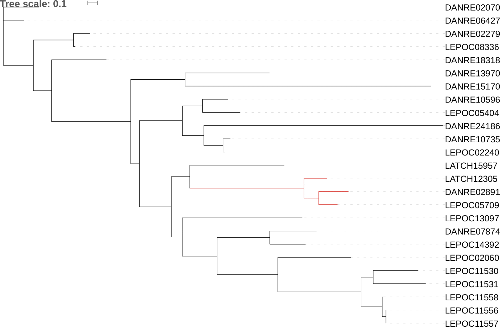

# Python API to get tree pdf images from iTOL #

API to remotely create tree images using the Interactive Tree of Life ([iTOL](https://itol.embl.de/)) website

With a newick tree, or list of newick trees, use the iTOL API from [albertyw github page](https://github.com/albertyw/itolapi) to remotely export pdf files of the tree(s)

Additional scripts and parameters also included such as
* Colour code certain branches on the tree
* Run task array on ARC3 to run multiple export jobs at once



---

## iTOL API script usage ##

Use the script `iTOL_API.py` to run the job on a single newick tree.

This script has two arguments that are required to run. These are your newick tree & an annotation file to colour labeled branches.

```Shell
python iTOL_API.py --tree tree.nwk --colour file.itol.colourstrips.txt
```

If you wish to create a tree without coloured branches, comment out line 14 and line 40 in the script and then run as

```Shell
python iTOL_API.py --tree tree.nwk
```

---

## Label specified branches by colour ##

If you wish to colour certain branches on the tree (`--colour` argument), you first need to create text files with the gene/species of interest labeled.

This is done by running the python script `make_itol_colourFile.py` 

* NOTE: this requred a file `label_IDs.txt` which is a text file of the gene/species IDs you wish to label on the tree, each on its own line

---

## Run script on multiple newick files at once in a task array on ARC3 ##

If you wish to run this on a number of newick trees at once, using a task array on ARC3, you must first create a cmds.txt file. This is a file with each job that you wish to run for each newick file. 

Eg.
```Shell 
python iTOL_API.py --tree tree1.nwk --colour file1.itol.colourstrips.txt
python iTOL_API.py --tree tree2.nwk --colour file2.itol.colourstrips.txt
python iTOL_API.py --tree tree3.nwk --colour file3.itol.colourstrips.txt
```

To create this file use the script `create_cmds_file.py`

The task array jobs can then by submitted using `qsub` to ARC3 by using the script (specifies 100 jobs, run 20 at a time):

```Shell
#$ -cwd                                                                                                                                             
#$ -V                                                                                                                                               
#$ -P omics                                                                                                                                         
#$ -l h_rt=48:00:00                                                                                                                                 
#$ -l h_vmem=20G                                                                                                                                    
#$ -t 1-100                                                                                                                                          
#$ -tc 20                                                                                                                                           

CMD=$(awk "NR==$SGE_TASK_ID" cmds_iToL.txt)
eval $CMD
```