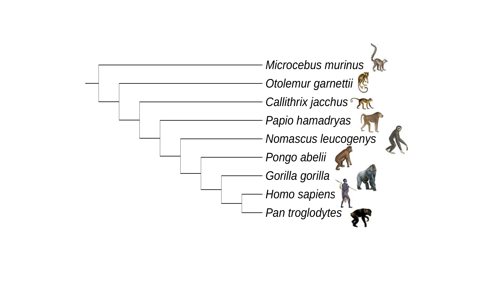

# Label internal nodes in a newick tree #

Python script to label internal nodes of a tree using the [ETE Toolkit](http://etetoolkit.org/docs/latest/tutorial/tutorial_trees.html#id3)

## Usage ##

Use the script `node_label.py` to run the job on a single newick tree.

The script has an argument required (`--tree`) to run. This is your input newick tree file:

```Shell
python node_label.py -tree treefile.nwk
```

---

## Example run ##

Given the tree file `primates.nwk`, showing the species tree for 9 primate taxa:

```Shell
((((((((Homo sapiens, Pan troglodytes), Gorilla gorilla), Pongo abelii), Nomascus leucogenys), Papio hamadryas), Callithrix jacchus), Otolemur garnettii), Microcebus murinus)
```



Label the internal nodes using `node_label.py` to produce labelled newick tree `primate_nodeLabel.newick`:

```Shell
((((((((Homo_sapiens,Pan_troglodytes)NODE_7,Gorilla_gorilla)NODE_6,Pongo_abelii)NODE_5,Nomascus_leucogenys)NODE_4,Papio_hamadryas)NODE_3,Callithrix_jacchus)NODE_2,Otolemur_garnettii)NODE_1,Microcebus_murinus);
```

---